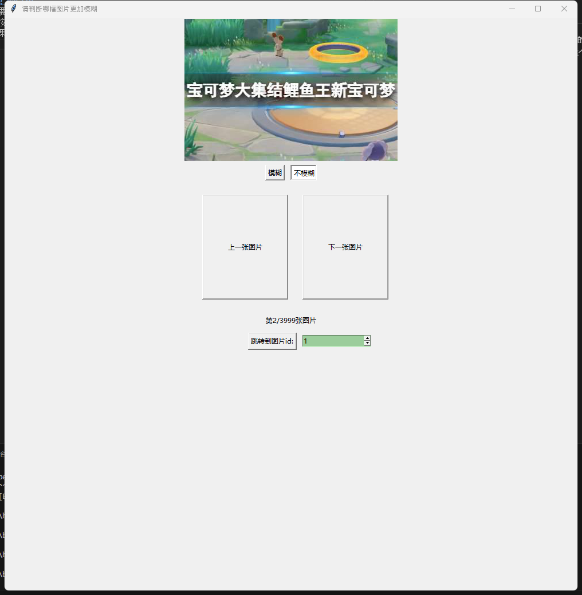
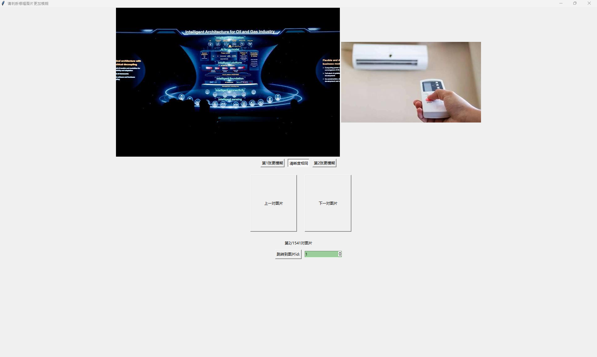

## label_pair_img_easily
- label_pair_img_easily：给成对图片打标签,so easy！
- 这个项目本身比较简单，主要用tkinter实现，仅一个python模块，是为了给想要打标签但是直接在文件夹看图片不太方便的同学并且不在意界面美观性的同学进行使用，由于实现时间较短，界面没有特意做美化。
## label pair image
- 现在大多数的打标签软件，主要是针对单个图片来打标签，本项目可以针对一对图片来打标签，并将结果进行保存，项目存在is_pair参数，可以通过控制此参数来控制给一对图片还是一副图片来打标签（一副图片打标签是在需要用到pairwise loss的场景里）
## 项目最终效果
- 单图标签

- 双图标签

## 项目准备
将需要标注的图片放到代码中img_root_path指定的路径下即可。代码中有比较充分的注释能够帮助大家理解
## 项目功能
    1. 上一张或下一张图片
    2. 显示目前是标注的第几张图片
    3. 通过输入图片id，直接跳转到指定id的图片
    4. 自动调节图片的大小，使得图片更加迎合窗口，方便用户查看
# 项目的一些特殊文件的含义
    1. 后缀为image_new.txt文件记录了图片名
    2. 后缀为record.log文件记录了标注过程中的标签
    3. 后缀为label.txt文件最后合并了图片名和标签，得到形如{图片名}-{标签的结果},也就是最终想要的结果